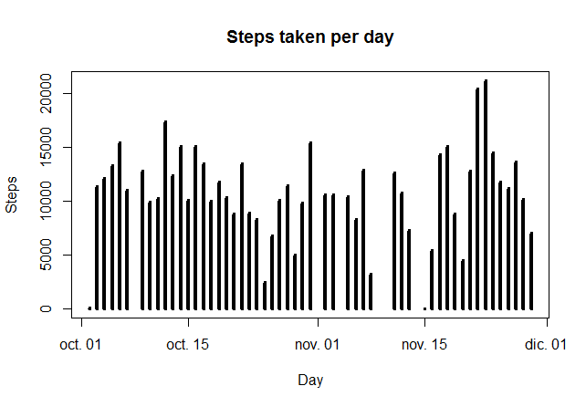

### -----------------------------------------------------------------------------------------------------------------

### Reproducible Research - Course Project 1

Author: molinerojo

Date: 2016-04-02

Description: The purpose of this script is to answer the quesionts of
the assignment 1 of the course Reproducible Research on Coursera.

Steps: Next tasks will be performed:

                1. Data Loading.
                2. Data Processing.
                3. Question 1 : What is mean total number of steps taken per day?.
                4. Question 2 : What is the average daily activity pattern?
                5. Question 3 : Imputing missing values
                6. Question 4 : Are there differences in activity patterns between weekdays and weekends?
                

### -----------------------------------------------------------------------------------------------------------------

### Data Set: Data from a personal activity monitoring device.

Description: This device collects data at 5 minute intervals through out
the day. The data consists of two months of data from an anonymous
individual collected during the months of October and November, 2012 and
include the number of steps taken in 5 minute intervals each day.

Variables: The variables included in this dataset are:

                1. steps: Number of steps taking in a 5-minute interval (missing values are coded as NA).
                2. date: The date on which the measurement was taken in YYYY-MM-DD format.
                3. interval: Identifier for the 5-minute interval in which measurement was taken.
                

The dataset is stored in a comma-separated-value (CSV) file and there
are a total of 17,568 observations.

URL:
<https://d396qusza40orc.cloudfront.net/repdata%2Fdata%2Factivity.zip>

### -----------------------------------------------------------------------------------------------------------------

### This script was created on the next environment:

R version: 3.2.3 (2015-12-10) -- "Wooden Christmas-Tree"

Platform: x86\_64-w64-mingw32/x64 (64-bit)

RStudio ver.:0.99.491 - © 2009-2015 RStudio, Inc.

### -----------------------------------------------------------------------------------------------------------------

### R-packages needed:

    library(ggplot2)     ## if this package is not installed do it running next code: install.packages("ggplot2")

    ## Warning: package 'ggplot2' was built under R version 3.2.4

    library(lubridate)   ## if this package is not installed do it running next code: install.packages("lubridate")

### -----------------------------------------------------------------------------------------------------------------

### STEP 1. Data Loading

DownLoading the Data Sets file

    path       <- getwd()
    file       <- "activity.zip"
    path_file  <- paste(path,file,sep="/")

    fileURL    <- "https://d396qusza40orc.cloudfront.net/repdata%2Fdata%2Factivity.zip"
    download.file(fileURL, destfile=path_file)

Unzip the Data Sets file: 7-zip is needed. Please modify the
installation folder name according to your environment.

    executable <- file.path("C:", "Program Files", "7-Zip", "7z.exe")
    parameters <- "x"
    cmd        <- paste(paste0("\"", executable, "\""), parameters, paste0("\"", path_file, "\""))
    system(cmd)

Load Data

    path        <- getwd()

    file_ds     <- file.path(path, "activity.csv")
    ds_activity <- read.csv(file_ds, stringsAsFactors = FALSE, sep=",", na.strings = "NA")

### -----------------------------------------------------------------------------------------------------------------

### STEP 2. Data Processing

Convert date from character to date

    ds_activity$date <- as.Date(ds_activity$date,"%Y-%m-%d")

### -----------------------------------------------------------------------------------------------------------------

### STEP 3. Question 1 : What is mean total number of steps taken per day?.

Summarize data by date

    ds_steps_by_day  <- aggregate(steps ~ date, ds_activity, sum)

Plot Histrogram by day

    plot(ds_steps_by_day$date, ds_steps_by_day$steps, type="h", lwd=4, main="Steps taken per day", xlab="Day", ylab="Steps")

<!-- -->

Calculate the mean of the total number of steps taken per day

    mean(ds_steps_by_day$steps, na.rm = TRUE)

    ## [1] 10766.19

Calculate the median of the total number of steps taken per day

    median(ds_steps_by_day$steps, na.rm = TRUE)

    ## [1] 10765

### -----------------------------------------------------------------------------------------------------------------

### STEP 4. Question 2 : What is the average daily activity pattern?

Summarize data by interval

    ds_steps_by_interval        <- aggregate(x = ds_activity$steps, by = list(ds_activity$interval), FUN = mean ,na.rm=TRUE)
    names(ds_steps_by_interval) <- c("interval","steps")

Time series plot of the average number of steps taken

    plot(ds_steps_by_interval$interval, ds_steps_by_interval$steps, type="l", lwd=1, main="Steps taken per interval", xlab="Interval", ylab="Steps")

<!-- -->

The 5-minute interval that, on average, contains the maximum number of
steps

    ds_steps_by_interval$interval[ds_steps_by_interval$steps == max(ds_steps_by_interval$steps, na.rm = TRUE)]

    ## [1] 835

### -----------------------------------------------------------------------------------------------------------------

### STEP 5. Question 3 : Imputing missing values

Calculate and report the total number of missing values in the dataset.

    sum(is.na(ds_activity$steps))

    ## [1] 2304

Strategy for filling in all of the missing values in the dataset. We
will create a new dataset with the NA values replaced by the total mean

    ds_activity_filled <- ds_activity

    total_mean <- mean(ds_activity$steps, na.rm = TRUE)

    for (i in 1:nrow(ds_activity_filled)) {
        if (is.na(ds_activity_filled[i,]$steps)) {
            
            ds_activity_filled[i,]$steps <- total_mean
        } 
    }

Summarize data by date

    ds_steps_by_day_filled  <- aggregate(steps ~ date, ds_activity_filled, sum)

Histogram of the total number of steps taken each day after missing
values are imputed

    plot(ds_steps_by_day_filled$date, ds_steps_by_day_filled$steps, type="h", lwd=4, main="Steps taken per day", xlab="Day", ylab="Steps")

<!-- -->

Calculate the mean of the total number of steps taken per day (with NA
replaced)

    mean(ds_steps_by_day_filled$steps, na.rm = TRUE)

    ## [1] 10766.19

Calculate the median of the total number of steps taken per day (with NA
replaced)

    median(ds_steps_by_day_filled$steps, na.rm = TRUE)

    ## [1] 10766.19

### -----------------------------------------------------------------------------------------------------------------

### STEP 6. Question 4 : Are there differences in activity patterns between weekdays and weekends?

Add factor variable for weekday or weekend

    Sys.setlocale("LC_ALL","English")

    ## [1] "LC_COLLATE=English_United States.1252;LC_CTYPE=English_United States.1252;LC_MONETARY=English_United States.1252;LC_NUMERIC=C;LC_TIME=English_United States.1252"

    ds_activity_filled$date_type <- weekdays(ds_activity_filled$date)

    ds_activity_filled$date_type <- gsub("Monday",   "weekday", ds_activity_filled$date_type)
    ds_activity_filled$date_type <- gsub("Tuesday",  "weekday", ds_activity_filled$date_type)
    ds_activity_filled$date_type <- gsub("Wednesday","weekday", ds_activity_filled$date_type)
    ds_activity_filled$date_type <- gsub("Thursday", "weekday", ds_activity_filled$date_type)
    ds_activity_filled$date_type <- gsub("Friday",   "weekday", ds_activity_filled$date_type)
    ds_activity_filled$date_type <- gsub("Saturday", "weekend", ds_activity_filled$date_type)
    ds_activity_filled$date_type <- gsub("Sunday",   "weekend", ds_activity_filled$date_type)

    ds_activity_filled$date_type <- as.factor(ds_activity_filled$date_type)

Summarize data by interval and date\_type

    ds_steps_by_day_filled_by_Interval_DateType <- aggregate(steps ~ interval + date_type, data = ds_activity_filled, mean)

Panel plot comparing the average number of steps taken per 5-minute
interval across weekdays and weekends

    ggplot(ds_steps_by_day_filled_by_Interval_DateType, aes(x=interval, y=steps)) + 
        geom_line() + facet_grid(date_type ~ .) +
        labs(x="Interval", y="Number of steps",
             title="Activity patterns on weekdays and weekends")

<!-- -->

### -----------------------------------------------------------------------------------------------------------------

### STEP 999. Remove large objects.

    rm(ds_activity)
    rm(ds_activity_filled)
    rm(ds_steps_by_day)
    rm(ds_steps_by_day_filled)
    rm(ds_steps_by_interval)
    rm(ds_steps_by_day_filled_by_Interval_DateType)
